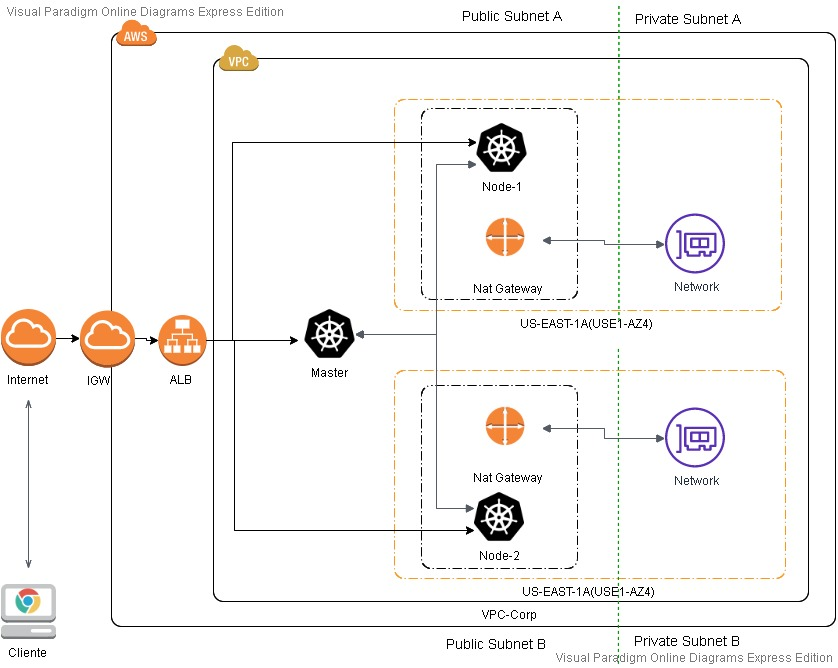

# Criação de Stack de infraestrutura com AWS, K8S, Terraform e Ansible  
Este projeto cria uma stack de infraestrutura que provisiona um ambiente para rodar uma aplicação backend rest hipotética, com duas réplicas respondendo em um Load Balancer, e uma aplicação frontend estática, ambas respondendo pelo mesmo DNS, porém com contextos (paths)distintos.  Isso, utilizando-se das tecnologias: Docker, k8s, AWS, Ansible e Terraform.

Na AWS, criaremos uma arquitetura que inclui uma VPC completa com subnets privadas e públicas, assim como as rotas padrões para acesso a internet por ambas as subnets através de IGW e NAT. Inclui também três EC2's onde instalaremos um cluster Kubernetes e ele será acessado via ALB para o balanceamento de carga entre esses equipamentos. Para isso, utilizaremos o Terraform como ferramenta para definirmos nossa infraestrutura como código.

Depois disso, utilizaremos o Ansible para realizarmos a instalação do Cluster K8's de três nós e efetuaremos o deploy das aplicações e elas irão responder em um Load Balancer.

**O diagrama abaixo mostra uma ilustração do que iremos construir:**



## Requisitos para criação do ambiente ##

* Ter uma conta e um usuário com acesso programático na AWS, caso não tenha, criar conforme documentação da cloud provider:
https://docs.aws.amazon.com/IAM/latest/UserGuide/id_users_create.html

* Ter ou criar um par de chaves ssh, como no comando abaixo:
```
$ apt-get update && apt-get install openssh-server -y && ssh-keygen -t rsa
```

* Exportar credenciais do seu usuário da aws como variáveis de ambiente:

```
$ export AWS_ACCESS_KEY_ID=$SUAKEY
$ export AWS_SECRET_ACCESS_KEY=$SUASECRETKEY
```
ou utilize os outros métodos de autenticação, conforme a documentação do Terraform:
https://www.terraform.io/docs/providers/aws/index.html

* Instalar o Terraform

* Instalar o Ansible

* Instalar o Git

## Instalação do Terraform no Debian ##

```
$ apt-get install wget unzip -y
$ wget https://releases.hashicorp.com/terraform/0.12.26/terraform_0.12.26_linux_amd64.zip
$ unzip terraform_0.12.26_linux_amd64.zip
$ chmod +x terraform
$ mv terraform /usr/local/bin/
$ terraform version
```

Para outros Sistemas Operacionais, consulte: https://learn.hashicorp.com/terraform/getting-started/install.html

## Instalação Ansible no Debian ##

```
$ apt-get install sudo -y
$ echo deb http://ppa.launchpad.net/ansible/ansible/ubuntu trusty main >> /etc/apt/sources.list
$ sudo apt-key adv --keyserver keyserver.ubuntu.com --recv-keys 93C4A3FD7BB9C367
$ sudo apt update
$ sudo apt install ansible -y
```
Opcional: Adicione o parâmetro: host_key_checking como False no arquivo de configuração do Ansible para que as chaves SSH não sejam validadas:
```
$ sed -i 's/#host_key_checking = False/host_key_checking = False/' /etc/ansible/ansible.cfg
```

## Instalação do Git ##
```
sudo apt-get install git -y
```
## Criando a infraestrutura na AWS ##

Primeiro baixamos o fonte do repositório
```
git clone https://github.com/moiferrsan/stackweb-k8s-docker-aws-terraform-ansible.git
```
Navegue até a pasta do projeto e execute o script de instalação

```
$ cd stackweb-k8s-docker-aws-terraform-ansible
$ ./setup.sh
```
**Caso queria fazer a instalação de forma manual, siga os passos abaixo:**

Navegue até a pasta do Terraform
```
$ cd terraform/
```
Inicializar o Terraform com os recursos da AWS Provider
```
$ terraform init
```
Verificar o que será criado
```
$ terraform plan
```
Criar os recursos
```
$ terraform apply -auto-approve
```
Setar os ips no arquivo de hosts do Ansible e o DNS do ALB no arquivo de criação dos ingress
```
$ sed -i "s/ip_publico_master/$(terraform output ip_publico_master)/g" ../ansible/k8s/hosts
$ sed -i "s/ip_publico_node1/$(terraform output ip_publico_node1)/g" ../ansible/k8s/hosts
$ sed -i "s/ip_publico_node2/$(terraform output ip_publico_node2)/g" ../ansible/k8s/hosts
$ sed -i "s/ip_privado_master/$(terraform output ip_privado_master)/g" ../ansible/k8s/hosts
$ sed -i "s/dns_alb/$(terraform output dns_alb)/g" ../ansible/k8s/roles/deploy-app/files/ingress-rules.yaml
```
Navegar até pasta do playbook

```
$ cd ../ansible/k8s/
```
Executar o playbook para instalação do K8S e deploy da aplicação

```
$ ansible-playbook -i hosts main.yml
```
Testar as rotas da aplicação via CURL

```
$ apt-get install curl -y
$ cd ../../terraform/
$ curl $(terraform output dns_alb)
$ curl $(terraform output dns_alb)/backend
``` 
Ou no seu navegador de internet

**Não se esqueça de destruir os recursos criados, caso eles nÃo sejam mais necessários**
```
$ terraform destroy -auto-approve
```  

## Roadmap de melhorias ##
 
* Implantar o Web Application Firewall da AWS (WAF) para proteger a aplicação de exploits comuns na Web.

* Implantar MultiMaster no Cluster k8s para garantir maior disponibilidade e resiliência do Cluster.

* Criar um Host Bastian e integrar com o IAM para limitar o acesso SSH nas EC2's

* Implantar o Monitoramento do k8s utilizando o CloudWatch e outras ferramentas terceiras como o Prometheus.

* Cria uma rotina de backup das instâncias e do ETCD com Lambda.

* Gravar o arquivo de estado do terraform em um bucket s3 para termos uma redundância do nosso versionamento da infraestrutura.

* Melhorar o código do projeto com Terraform modules

* Utilizar alguma ferramenta de CI/CD para deployar as aplicações (GitLab, por exemplo)

* Implantar https para melhorar a segurança do ambiente.

* Limitar o acesso SSH através de regras nos Security Groups, permitindo apenas redes conhecidas.

* Criar Helm Charts para deployar a aplicação

* Avaliar a utilizá lização do serviço gerenciado de Kubernetes da AWS (EKS)

